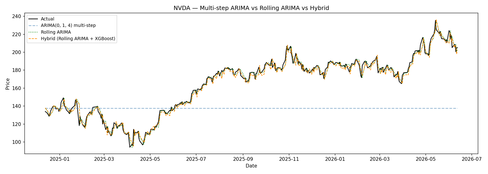

[](https://classroom.github.com/a/-bKyY6qM)
[](https://classroom.github.com/online_ide?assignment_repo_id=23948756&assignment_repo_type=AssignmentRepo)

<h1 align="center">A Hybrid ARIMA + XGBoost Model for Forecasting Volatile AI Semiconductor Stocks</h1>

<p align="center">
  
  
  
  
  
</p>

<p align="center">
  ACM 40960 Mathematical Modelling &nbsp;·&nbsp; University College Dublin &nbsp;·&nbsp; 2026
</p>

A two stage forecasting model applied to eight AI semiconductor stocks. ARIMA
handles the linear part of the price series, XGBoost is trained on the errors
ARIMA leaves behind, and the two predictions are added together.

The short version of what we found: the hybrid does not beat ARIMA on its own,
and neither of them beats simply guessing that tomorrow's price equals today's.
The rest of this file explains how we got there and why it happens.

---

### Contents

- [Motivation](#motivation)
- [Methodology](#methodology)
- [Results](#results)
- [Limitations](#limitations)
- [Future Work](#future-work)
- [Reproduction](#reproduction)
- [Directory Structure](#directory-structure)
- [References](#references)
- [Authors](#authors)
- [License](#license)

---

## Motivation

AI semiconductor stocks are among the toughest cases when it comes to testing any
statistical model on public stocks. The fluctuations driven by cycles in GPU
demands, supply shortages, and earnings shocks cannot be followed by the ordinary
statistical model. Both ARM and SMCI have a daily return standard deviation of
4.80%, which is twice that of TSM's 2.36%.

ARIMA is considered a statistical benchmark for financial time series. However,
with its traditional multi-step approach, ARIMA provides forecasts for each test
day at once. Without any new information, the forecast tends to move toward the
unconditional mean and level off. It is in that case where the 20% to 49% error
arises in our model.

Wang and Guo (2020) propose splitting the series into two parts:

```
y  =  L  +  N

L = the linear component is handled by ARIMA model
N = the nonlinear leftover is handled by XGBoost model
```

The assertion is that N remains learnable, and the three other studies corroborate
this claim. The common problem with all the four studies is that none of them has
tested their designs using AI semiconductor stocks, which is the most volatile
type of equities for today's particular period. None of the four studies provided
us a naive benchmark either to support our idea.

We picked eight tickers spanning the whole chip supply chain so the result would
not depend on one business model only:

| Ticker | Company | Role in the chain |
|---|---|---|
| NVDA | NVIDIA | GPUs |
| AMD | Advanced Micro Devices | GPUs and CPUs |
| SMCI | Super Micro Computer | AI servers |
| ARM | Arm Holdings | chip architecture licensing |
| MU | Micron Technology | memory |
| 000660.KS | SK Hynix | memory, listed in Korea |
| AVGO | Broadcom | networking silicon |
| TSM | Taiwan Semiconductor | fabrication |

---

## Methodology

Five scripts run in sequence. Each stage below corresponds to a block in the
diagram.


### Collecting and cleaning the data

`data_collection.py` downloads daily bars from Yahoo Finance starting from
2 January 2019 until 12 June 2026.

We use `auto_adjust=True`, which is very crucial here. Splits and dividends are
applied backwards through the whole series, so NVDA starts at $3.37 rather than
$33.70 since ten for a split has already been incorporated in as of June 2024. In
the absence of that, the split would be flagged as a 90% overnight crash, and
ARIMA would classify it as an actual occurrence.

Cleaning eliminates duplicate dates, forces prices and volume to be numerical, and
sorts in ascending order. Nothing could be fixed. Zero rows removed and zero
missing values across all eight tickers, which `cleaning_report.csv` records as
evidence the check actually ran.

| Ticker | Rows | Period |
|---|---|---|
| NVDA, AMD, SMCI, MU, AVGO, TSM | 1872 | 2019-01-02 to 2026-06-12 |
| 000660.KS | 1824 | 2019-01-02 to 2026-06-12 |
| ARM | 689 | 2023-09-14 to 2026-06-12 |

Two of those counts differ on purpose. Since ARM only listed in September 2023, it
has 689 days, or about one-third of the other companies' histories. Because the
Korea Exchange uses a different holiday schedule, SK Hynix has a value of 1824.

### Dividing the train from the test by the split of 80/20

20% test and 80% training, in a strictly chronological order with no rearranging.
The simplest technique to get results that look great but are meaningless is to
shuffle a price series, which would allow the model to glimpse into the future.

The test window is from December 2024 to June 2026 for the majority of tickers,
which provide 1498 training days and 374 test days.

### Looking at the series before modelling

`exploratory_analysis.py` produces the price and return charts and two summary
tables. Three things come out of it.

**Nothing remains motionless.** Over the course of the period, each series
increases by one to two orders of magnitude; neither the mean nor the variance
remain constant. ARIMA cannot accept raw pricing in their current state.

**Clusters of volatility.** There are periods of calm, within 3% or less,
interspersed with periods of turbulence, when 10% days are typical. The 21-day
rolling volatility of NVDA ranges from about 1.5% to 8.7%. The entire conclusion
is based on this, the dataset's single most significant attribute.

**They have fat tails.** Everywhere, excess kurtosis is positive; it is most
extreme for ARM at 17.21, SMCI at 11.71, and AVGO at 10.38. In February 2024,
immediately following its maiden earnings announcement as a publicly traded firm,
ARM had a 47.89% single-day rise. That is a genuine action, not a data error.

| Ticker | Mean daily | Std dev | Max gain | Max drop | Skew | Kurtosis |
|---|---|---|---|---|---|---|
| ARM | 0.370% | 4.80% | 47.89% | -19.46% | 1.93 | 17.21 |
| SMCI | 0.275% | 4.80% | 35.94% | -33.32% | 0.58 | 11.71 |
| AMD | 0.237% | 3.49% | 23.82% | -17.31% | 0.63 | 4.73 |
| MU | 0.237% | 3.29% | 19.29% | -19.82% | 0.18 | 3.78 |
| NVDA | 0.271% | 3.20% | 24.37% | -18.45% | 0.31 | 4.67 |
| 000660.KS | 0.241% | 2.88% | 15.91% | -11.50% | 0.43 | 2.68 |
| AVGO | 0.191% | 2.68% | 24.43% | -19.91% | 0.31 | 10.38 |
| TSM | 0.167% | 2.36% | 12.65% | -14.03% | 0.20 | 3.24 |

We mark only the COVID crash on the price charts. We originally marked four events
and cut it to one after measuring realised volatility 60 days forward against each
stock's own baseline. COVID pushed it up in every ticker that was trading, from
1.13x to 1.94x. The ChatGPT announcement did not, staying in the 0.68x to 1.25x
range. It is important to note that while the ChatGPT launch caused a massive
price movement, with NVDA going up 137% in the next six months, it did not cause
any volatility movement. It is a level event, not a variance event, and this
project is about the variance.

### Stationarity test

`arima_forecasting.py` conducts Augmented Dickey Fuller tests to set the `d`
variable by ticker instead of using a fixed `d` parameter.

The null hypothesis in this case is "non-stationary" and therefore a small p-value
is our desired result. That works counter to people's expectations and needs to be
stated explicitly.

- Raw prices: none of the eight prices are stationary
- First difference: seven of eight prices become stationary and therefore `d = 1`
- MU fails to become stationary at `d = 1` with p = 0.5515 and succeeds at
  `d = 2`, so `d = 2`

### Selecting the ARIMA order

Grid search of all 36 combinations of p and q, ranging from 0 to 5, for each
ticker based on the BIC criterion rather than the AIC criterion.

This decision is made on purpose because the penalty term that is associated with
AIC is insufficient when a time series is nearly like white noise, as proven by
the ACF and PACF plots for the series. As a result, AIC tends to choose bigger
models which perform history fitting slightly better but forecasting slightly
worse.

| Ticker | Order | AIC | BIC | In-sample MAPE |
|---|---|---|---|---|
| NVDA | (0,1,4) | 8536.97 | 8564.65 | 2.33% |
| AMD | (2,1,2) | 11482.37 | 11510.04 | 2.51% |
| SMCI | (0,1,4) | 7851.97 | 7879.64 | 2.99% |
| ARM | (0,1,0) | 4725.07 | 4729.60 | 3.16% |
| MU | (2,2,4) | 13207.45 | 13246.18 | 2.56% |
| AVGO | (4,1,0) | 11147.51 | 11175.18 | 1.83% |
| TSM | (0,1,1) | 10238.64 | 10249.70 | 1.72% |
| 000660.KS | (5,1,3) | 40884.03 | 40933.61 | 2.62% |

**ARM selects ARIMA(0,1,0), which is the random walk.** Offered 36 orders, BIC
concluded that no ARMA structure was worth estimating at all. Hold onto that, it
comes back in the results.

### Fitting and forecasting

Only 80% of the training set is used to fit the model, and before the test set is
used, the parameters are locked. We derive three things from that one fit.

**Forecast in multiple steps.** One call is used to predict every test day, and it
is never updated. This is the configuration the literature normally reports, and
it is the one that flattens out.

**Rolling forecast in one step.** Make a prediction for tomorrow, observe the
outcome, add the information to the model's knowledge base, and then make another
prediction. Crucially, `refit=False` is used here to ensure the coefficients
remain at their trained values while only the model's memory of recent prices
moves forward. Refitting would mean learning from the test set.

**Residuals within the sample.** Actual minus fitted during the training period.
This is what XGBoost learns from.

### Checking what ARIMA missed

Two Ljung-Box tests, which ask genuinely distinct questions.

| Test | Question | Rejects |
|---|---|---|
| Ljung-Box on residuals | is the **direction** of the error patterned? | 5 of 8 |
| Ljung-Box on squared residuals (ARCH) | is the **size** of the error patterned? | 8 of 8, p < 0.0001 |

The project's conclusion is the space between those two rows. Direction is almost
unpredictable. Magnitude is highly predictable, which is the formal restatement of
volatility clustering.

`acf_summary_plot.py` shows the same thing from the other direction. Across the
differenced series the strongest autocorrelation found anywhere in six of the
eight tickers is 0.136, and none of those six has a single lag above 0.20.


| Ticker | Largest \|ACF\| after differencing | Lags above 0.20 |
|---|---|---|
| ARM | 0.087 | 0 |
| NVDA | 0.091 | 0 |
| SMCI | 0.123 | 0 |
| AMD | 0.128 | 0 |
| TSM | 0.132 | 0 |
| AVGO | 0.136 | 0 |
| 000660.KS | 0.233 | 4 |
| MU | 0.445 | 6 |

One caution on reading that table. With around 1870 observations the 95%
confidence band sits at only plus or minus 0.045, so a correlation of 0.05 counts
as statistically significant while being useless in practice. At this sample size
magnitude matters far more than significance.

MU's -0.445 at lag 1 is not structure, it is the textbook signature of over
differencing. ADF forced `d = 2` on it, and taking one difference too many
introduces negative autocorrelation that was not in the data.

### Correcting the residuals with XGBoost

`hybrid_model.py` trains a gradient boosted tree on the training residuals using
features ARIMA structurally cannot see, since ARIMA only ever looks at past values
of the price itself:

lagged returns at 1, 2, 3, 5 and 10 days, a 21 day rolling volatility, three
moving average ratios, volume change, volume against its 20 day average, the
intraday high to low range, a momentum term and day of week.

Every feature is shifted forward one day, so the row for day `t` contains only
what was knowable at the close of `t-1`. Without that shift the model reads the
answer off the question paper and the results are meaningless.

The prediction is then simply added on top:

```
hybrid = rolling ARIMA forecast + XGBoost residual correction
```

---

## Results

The models are compared using the same 20% test data set, based on ticker, by
MAPE. We start with MAPE since SK Hynix trades at about 2,150,000 KRW and TSM at
about $424, so an absolute error of "1000" represents two very different values.
Percentages can be compared, but the currency units are not. RMSE and MAE are in
`model_comparison.csv` alongside.

| Ticker | ARIMA multi-step | Rolling ARIMA | Hybrid |
|---|---|---|---|
| TSM | 27.69% | **1.93%** | 2.17% |
| NVDA | 20.92% | **2.04%** | 2.18% |
| AVGO | 36.59% | **2.28%** | 2.66% |
| AMD | 32.16% | **2.73%** | 2.93% |
| 000660.KS | 49.35% | **3.05%** | 3.34% |
| MU | 39.35% | **3.31%** | 3.51% |
| ARM | 22.18% | **3.44%** | 3.92% |
| SMCI | 20.98% | **4.20%** | 4.49% |
| **Mean** | **31.15%** | **2.87%** | **3.15%** |

Three things come out of this table.

**Rolling ARIMA beats multi step ARIMA by roughly ten times.** 2.87% against
31.15%. This looks like the headline result and it is the one most easily
misread, so it gets its own paragraph below.

**The hybrid method performs poorly compared to the ARIMA model, and that too for
all eight stock tickers.** Poorly on all eight, not just most. The XGBoost part of
the hybrid is about 0.28 percentage points poorer on average. Anything it has
learned from the residuals during the training period does not seem to help in the
test period.

**What improved performance is not the model but the horizon.** The naive random
walk forecast, which assumes that tomorrow's closing price equals today's closing
price, has a mean absolute percentage error of 2.86% on the same test set using
the same one step protocol. The rolling ARIMA has a MAPE of 2.87%. That explains
99.9% of the apparent gain from 31.15%. What improved between the two models is
not its forecasting ability but the horizon into which it had to forecast.

ARM provides an example here. For ARM, the rolling ARIMA MAPE and the naive
benchmark MAPE are equal at **3.444295%**, identical to six decimal points. This
is because, using the Bayesian Information Criterion, the ARIMA(0,1,0) model,
which is the random walk model, was chosen. Out of 36 possible order combinations,
it independently decided "do not model this".



### Why the hybrid fails

This is not a bug and it is not a tuning problem. The diagnostics predicted it
before the hybrid was ever run.

ARIMA's residuals carry structure in their variance and almost none in their mean.
ARCH tests reject on 8 of 8 tickers at p < 0.0001, so the size of tomorrow's error
is genuinely forecastable. But XGBoost was trained to predict the signed residual,
which is the direction and magnitude together, and direction is where the signal
is thinnest. Six of eight tickers have no autocorrelation above 0.14 anywhere in
the differenced series.

So the model was pointed at the half of the problem that has almost nothing in it,
while the half that does have something was never targeted. It fit noise in the
training residuals and carried that noise into the test period, which is exactly
why the correction is negative rather than merely zero.

There is a second, smaller effect, where XGBoost trains on in-sample residuals,
which are systematically smaller and better behaved than the out-of-sample errors
it is asked to correct. We tested a 60/20/20 split so the model could learn from
genuinely out-of-sample residuals instead. Residual correlation fell from 0.205 to
0.130 and coverage dropped from 80% to 65%, so it made things worse and we kept
the simpler design.

---

## Limitations

Stated plainly, because they bound what these results can be read to mean.

- **One testing window.** From December 2024 to June 2026, the trend within the
  sector was upward. One regime is insufficient to make any generalisations about
  the technique.
- **Survivorship bias.** All eight tickers represent successful companies that
  made it through the AI cycle. Failing firms have been excluded from the sample.
- **ARM has the least historical data**, at a third of the others. 689
  observations against roughly 1872, and only 137 test days. Its ARIMA(0,1,0)
  selection could be attributed to the limited sample size.
- **Over differencing.** MU is an over differenced series where ADF imposes
  `d = 2`, resulting in the -0.445 lag 1 autocorrelation highlighted above. The
  test result and the plot are inconsistent, and we stuck with the former.
- **Model parameters remain fixed.** `refit=False` assures us of a fair rolling
  forecast. However, it means that the model does not adapt throughout the entire
  18 month test period.
- **Wavelet decomposition missing.** Wang and Guo applied discrete wavelet
  decomposition to the series before passing them into ARIMA so that each model
  gets the component that best fits it. We omitted the step, and this is the
  probable single cause of the discrepancy.

---

## Future Work

- **Target the variance instead of the mean.** This is the obvious next step and
  it follows directly from the diagnostics. ARCH effects reject on 8 of 8, so
  fitting GARCH, EGARCH or GJR-GARCH to the ARIMA residuals models the quantity
  that is actually predictable. Benchmark against HAR-RV.
- **Predict direction as a classification problem.** If the signed residual has
  no signal, ask a simpler question instead: will the price rise or fall? That
  turns it into a two class problem where accuracy and F1 become meaningful
  metrics, and a model only has to clear 50% to be worth something.
- **Add cross-stock and market-wide features.** The SOX semiconductor index and
  the VIX would give the model information about sector and market regime that
  no single ticker's own history contains.
- **Force `d = 1` for MU** and compare against the ADF driven `d = 2`, to measure
  what over differencing actually costs in forecast terms.
- **Walk-forward validation** across several non-overlapping windows including at
  least one drawdown, rather than a single uptrend.
- **Add the wavelet decomposition step** from Wang and Guo, which is the clearest
  methodological difference between their setup and ours.

---

## Reproduction

Clone the repository:

```bash
git clone https://github.com/ACM40960/projects-DataForge-team.git
cd projects-DataForge-team/arima_xgboost_project
```

Install the dependencies:

```bash
pip install pandas numpy statsmodels xgboost matplotlib scikit-learn yfinance
```

Run the scripts in this order. `arima_forecasting.py` has to come before the last
two, since both read the orders it selects from `arima_fit_summary.csv`:

```bash
python data_collection.py        # ~1 min, needs internet. optional, the CSVs are committed
python exploratory_analysis.py   # ~20 sec
python arima_forecasting.py      # ~6 min, this is the grid search
python acf_summary_plot.py       # ~5 sec
python hybrid_model.py           # ~1.5 min
```

Approximately eight minutes in total.

Regarding reproducibility, the dataset does not drift because `END_DATE` in
`data_collection.py` is pegged to 2026-06-14. Since the cleaned CSVs have been
committed and re-downloading runs the danger of Yahoo Finance changing a
historical bar, you can skip `data_collection.py` completely.

The multi-step and rolling MAPE figures, ADF results, BIC ordering, and the ACF
summary all reproduce precisely. Because thread scheduling modifies the order of
floating point summation within XGBoost and the optimiser lands at slightly
different locations, hybrid MAPE varies by up to 0.15 percentage points per ticker
across machines. The ranking remains unchanged, and the mean remains at 3.15%.

---

## Directory Structure

```
arima_xgboost_project/
├── data_collection.py           downloads the 8 tickers from Yahoo Finance,
│                                cleans them, writes one CSV per stock
├── exploratory_analysis.py      price and return charts, rolling volatility,
│                                summary statistics tables
├── arima_forecasting.py         ADF tests, BIC grid search, model fitting,
│                                residual diagnostics, ACF/PACF plots
├── acf_summary_plot.py          strongest autocorrelation per ticker,
│                                all eight collapsed onto one figure
├── hybrid_model.py              rolling forecast, XGBoost residual correction,
│                                final model comparison
├── flow_diagram.png             the pipeline figure used above
├── data/                        8 cleaned CSVs, one per ticker
├── residuals/                   per-ticker ARIMA output passed to stage 2
└── results/
    ├── tables/
    │   ├── cleaning_report.csv           rows removed, missing values
    │   ├── closing_price_summary.csv     min, max, latest, total return
    │   ├── daily_returns_summary.csv     mean, std dev, skew, kurtosis
    │   ├── adf_test_results.csv          raw and first difference
    │   ├── adf_second_difference_results.csv
    │   ├── adf_final_d_selection.csv     chosen d per ticker
    │   ├── arima_fit_summary.csv         orders, AIC, BIC, diagnostics
    │   ├── acf_summary.csv               max |ACF| per ticker
    │   └── model_comparison.csv          the results table above
    └── plots/
        ├── closing_prices/        price series with the COVID marker
        ├── daily_returns/         returns and 21-day rolling volatility
        ├── acf_pacf_plots/        ACF and PACF per ticker
        ├── acf_summary/           the summary figure
        └── forecast_comparison/   multi-step vs rolling vs hybrid
```

---

## References

1. Adebiyi, A.A., Adewumi, A.O., Ayo, C.K. (2014). *Stock Price Prediction Using
   the ARIMA Model.* 16th UKSim-AMSS International Conference on Computer
   Modelling and Simulation, IEEE.
2. Wang, Y., Guo, Y. (2020). *Forecasting Method of Stock Market Volatility Based
   on Mixed Model of ARIMA and XGBoost.* China Communications, IEEE.
3. Somkunwar, R.K., Pimpalkar, A., Srivastava, V. (2024). *A Novel Approach for
   Accurate Stock Market Forecasting by Integrating ARIMA and XGBoost.* IEEE
   SCEECS.
4. Zhang, F., Chen, L., Yu, J. (2022). *A Two-Stage ARIMA Model via Machine
   Learning and its Application in Stock Price Prediction.* BCP Business and
   Management, 26, 400 to 408.

Price data from [Yahoo Finance](https://finance.yahoo.com) via the `yfinance`
package.

---

## Authors
**Asawari Lad**  
Module: ACM 40960 — Mathematical Modelling  
University College Dublin

**Soham Barve**  
Module: ACM 40960 — Mathematical Modelling  
University College Dublin

---

## License

MIT. See [LICENSE](LICENSE).

**Disclaimer.** This project is academic work. Nothing in it is financial advice,
and the results explicitly show that these models do not beat a random walk.
