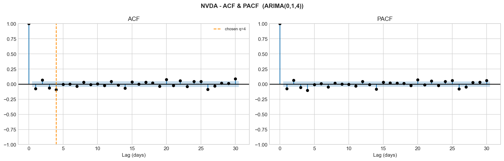
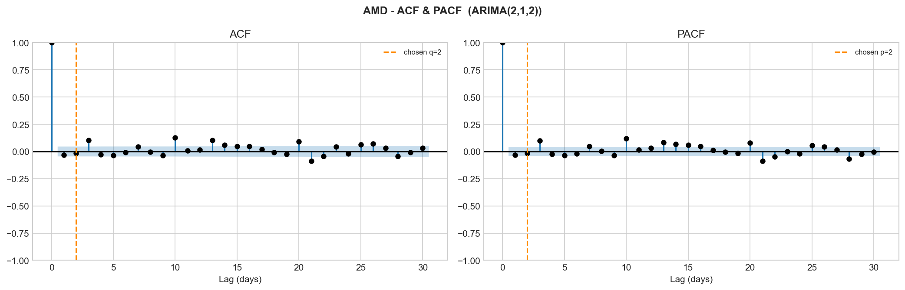
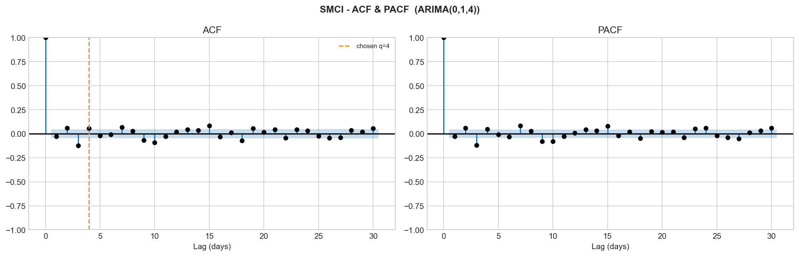
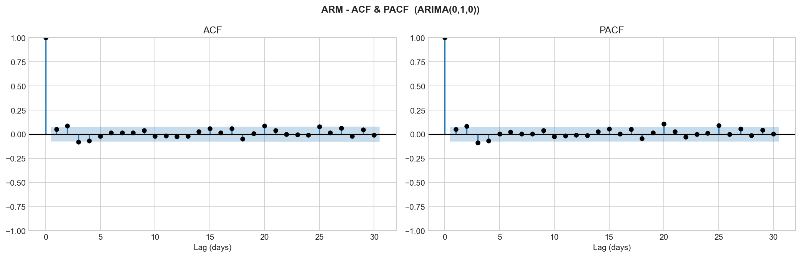
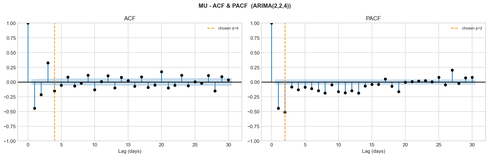
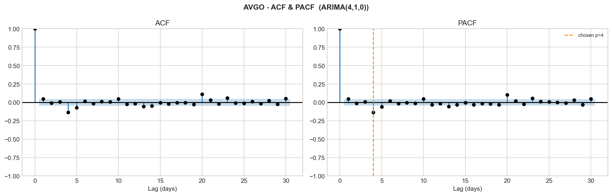
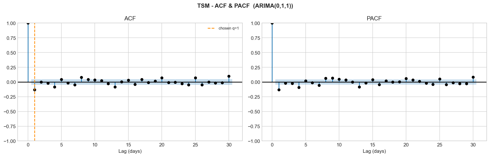
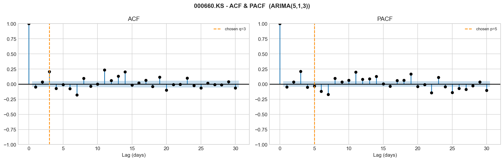

# ARIMA Modeling Report

**For:** Asawari (XGBoost stage) and anyone reviewing the ARIMA side of the project
**Code:** `arima_forecasting.py`
**Outputs:** `results/tables/`, `results/plots/acf_pacf_plots/`, `residuals/`

This document explains everything done on the ARIMA side in plain language —
what we did, why, what the plots show, what changed between two versions of
the model, what the numbers mean, and exactly how to use the output files.

---

## 1. The one-sentence version

We're forecasting 8 stock prices using ARIMA (a classic time-series model).
ARIMA can only capture the "simple" linear part of how a stock moves. What's
left over — the part it can't explain — is saved separately as `Residual`,
and that's what XGBoost is meant to learn next. Two files matter most:

```
y (actual price) = L (ARIMA's prediction) + N (the residual, XGBoost's job)
```

Every ticker has one combined file: `residuals/{ticker}_arima_output.csv`.
That's the only file needed to start the XGBoost stage.

---

## 2. Figuring out how much to "difference" each stock (`d`)

Stock prices trend up and down over time, which technically confuses ARIMA —
it needs a series that doesn't trend, just wobbles around a fixed average.
The fix is "differencing": instead of looking at the price itself, look at
*the change* from yesterday to today. Sometimes one round of that isn't
enough and you need to do it twice.

We tested this formally (the ADF test) instead of guessing, and found:

| Ticker | Needs differencing how many times? (`d`) |
|---|---|
| NVDA, AMD, SMCI, ARM, AVGO, TSM, 000660.KS | 1 |
| MU | 2 |

MU was the only stock that needed differencing twice — its trend was a bit
more complex than the others.

---

## 3. Fitting ARIMA per stock

For each of the 8 tickers, three numbers had to be chosen: `p`, `d`, `q`.
`d` came from Task 6. `p` and `q` decide how many past days' prices and past
days' errors the model pays attention to.

To pick `p` and `q` properly (not guess), we:
1. Plotted **ACF** and **PACF** — visual tools that show whether today's
   price is related to prices from a few days ago
2. Ran a systematic search trying 36 different combinations of `p` and `q`,
   fit each one, and kept whichever fit the data best

---

## 4. The plots — what ACF and PACF actually show, ticker by ticker

**How to read these:** each ticker has two side-by-side charts. Every bar
represents "how related is today's price change to N days ago." The light
blue shaded band is the "this could just be random noise" zone — a bar
inside the band isn't meaningfully different from randomness; a bar poking
outside is a real signal. The orange dashed line marks whichever lag the
model actually picked as `p` or `q`.

### NVDA


Almost every bar sits inside the confidence band — NVDA's day-to-day price
changes don't show much of a repeating pattern. Final BIC pick was
ARIMA(0,1,4) — no AR terms, a small MA component. The orange line in the ACF
panel would now sit at lag 4.

### AMD


Same story — nearly flat, both panels close to noise. Final pick:
ARIMA(2,1,2), a modest, symmetric AR/MA structure. Orange lines would sit at
lag 2 on both panels now (moved in from the original AIC pick of lag 4).

### SMCI


Mostly flat with a couple of small dips around lag 3 and lag 9-10 — nothing
dramatic. Final pick: ARIMA(0,1,4). Interesting twist: even at this simpler
order, SMCI's residuals still failed the pattern check (more on this in
Section 6) — meaning there's a real, if subtle, structure here that a
low-order ARIMA still can't fully capture.

### ARM


The flattest of all 8 — almost every single bar sits inside the band, across
both panels. Final pick: **ARIMA(0,1,0)** — the simplest model possible,
literally zero AR or MA terms. There's no orange line to show at all,
because both p and q came out as 0. This plot is basically confirming "this
looks like pure random noise," and the model search agreed.

### MU


**This one looks completely different from the rest.** Real, sharp spikes
outside the confidence band — a strong negative dip at lag 1 (around -0.45),
another at lag 2/3, and matching sharp negative spikes in the PACF panel.
This is the one ticker where the ACF/PACF plot is telling you there's
genuine, visually obvious structure — not something you have to squint for.
Final pick: ARIMA(2,2,4) (unchanged between AIC and BIC — the structure here
is real enough that both criteria agreed).

### AVGO


Mostly flat with one modest dip around lag 4. Final pick: ARIMA(4,1,0) — all
AR, no MA. The orange line in the PACF panel would now sit at lag 4.

### TSM


Flat overall, with a small but visible dip right at lag 1. Final pick:
ARIMA(0,1,1) — and that single MA term lines up exactly with the lag-1 dip
visible in the plot. This is a case where the simplified BIC model and the
visual plot agree cleanly.

### 000660.KS (SK Hynix)


The most "textured" plot of the 8 — visible bars poking outside the band at
several lags (around 3, 7, 11, 14). Final pick: ARIMA(5,1,3) (unchanged
between AIC and BIC — like MU, there's enough real structure here that both
criteria landed on the same, more complex model).

---

## 5. Two ways of picking the model — and what we learned by comparing them

We tried two different rules for picking the "best" `p`/`q`, one after the
other, and comparing them taught us something important.

### AIC vs BIC — what's the difference in plain terms

Both are scores that say "how good is this model," but they penalize
complexity differently. **AIC** is fairly lenient about adding more
parameters. **BIC** punishes extra parameters much more harshly, especially
with a lot of data (we have ~1,800 rows per ticker). Same 36 candidate
models get tried either way — the only difference is which one "wins."

### Full comparison table

| Ticker | AIC order | AIC RMSE | AIC MAE | AIC MAPE | BIC order | BIC RMSE | BIC MAE | BIC MAPE |
|---|---|---|---|---|---|---|---|---|
| NVDA | (3,1,3) | 16.63 | 14.27 | 6.51% | (0,1,4) | 15.89 | 13.52 | 6.17% |
| AMD | (4,1,4) | 110.17 | 100.01 | 20.86% | (2,1,2) | 116.51 | 105.87 | 22.08% |
| SMCI | (2,1,5) | 10.86 | 8.71 | 21.79% | (0,1,4) | 10.91 | 8.78 | 22.00% |
| ARM | (0,1,4) | 104.82 | 77.98 | 22.64% | (0,1,0) | 105.38 | 78.50 | 22.80% |
| MU | (2,2,4) | 311.61 | 281.81 | 32.15% | (2,2,4) | 311.61 | 281.81 | 32.15% |
| AVGO | (1,1,5) | 24.51 | 16.72 | 3.96% | (4,1,0) | 24.51 | 16.74 | 3.96% |
| TSM | (2,1,4) | 23.12 | 18.34 | 4.32% | (0,1,1) | 23.56 | 18.84 | 4.44% |
| 000660.KS | (5,1,3) | 713397.29 | 642615.56 | 31.57% | (5,1,3) | 713397.29 | 642615.56 | 31.57% |

*(RMSE/MAE are in the ticker's native currency — dollars for all except
000660.KS, which is Korean Won, hence the much larger raw numbers there.
MAPE is the fair way to compare across tickers since it's a percentage.)*

### What we expected vs. what we actually found

We originally suspected the AIC-selected models were "overfit" — too
complex, fitting noise instead of real patterns, which would explain the
high error on some tickers. So we switched to BIC expecting the error
numbers (RMSE/MAE/MAPE) to drop noticeably.

**They mostly didn't.** Look at ARM: BIC picked the absolute simplest
model possible — ARIMA(0,1,0), meaning "just assume tomorrow's price equals
today's" — and the forecast error barely moved (22.64% → 22.80%, technically
even a hair worse). AMD and TSM actually got *slightly worse* under BIC's
simpler models.

**This is actually a more useful finding than if BIC had fixed everything.**
It proves the high error on AMD, SMCI, ARM, MU, and 000660.KS was never
about picking the wrong model complexity — even the simplest possible model
still has that much error. The real explanation: these are the more volatile
stocks (we already knew this from the earlier volatility analysis), and a
30-day forecast for a volatile stock is just genuinely hard for any linear
model, no matter how it's tuned. That's not a flaw in the code — it's the
actual mathematical ceiling of what ARIMA can do here, and it's exactly the
gap XGBoost exists to close.

### The in-sample vs. holdout gap (only available for the BIC run)

| Ticker | In-sample MAPE (fit to data already seen) | 30-day holdout MAPE (forecast on unseen data) |
|---|---|---|
| NVDA | 2.33% | 6.17% |
| AMD | 2.51% | 22.08% |
| SMCI | 2.99% | 22.00% |
| ARM | 3.16% | 22.80% |
| MU | 2.56% | 32.15% |
| AVGO | 1.83% | 3.96% |
| TSM | 1.72% | 4.44% |
| 000660.KS | 2.62% | 31.57% |

Every ticker fits its own past data quite well — in-sample error never goes
above ~3.2%. But look at the jump to the holdout column for AMD, SMCI, ARM,
MU, and 000660.KS — up to 10x worse. That gap is the clearest evidence in
this whole report: ARIMA learns the history well, but forecasting even a
month ahead is a completely different, much harder problem for these
particular stocks.

---

## 6. Which stocks pass, and which need XGBoost most

Two separate checks were run on every stock's leftover errors (residuals):

**Check 1 — is there still a pattern in the residuals?** (Ljung-Box test)
If yes, ARIMA missed something predictable in the average behavior.

**Check 2 — is there a pattern in how big the errors are, even if not their
direction?** (this is the ARCH test, run on squared residuals) This catches
"volatility clustering" — calm stretches followed by turbulent stretches.
ARIMA fundamentally cannot fix this no matter how it's tuned, since it only
models the average, not how much the average might swing.

| Ticker | Residuals still show a pattern? | Volatility clustering? |
|---|---|---|
| NVDA | No (clean) | Yes |
| AMD | **Yes** | Yes |
| SMCI | **Yes** | Yes |
| ARM | No (clean) | Yes |
| MU | **Yes** | Yes |
| AVGO | No (clean) | Yes |
| TSM | **Yes** | Yes |
| 000660.KS | **Yes** | Yes |

**Every single ticker shows volatility clustering** — this is the direct
proof that a plain linear model (ARIMA) isn't the full answer for any of
these 8 stocks, which is the core reason the project pairs it with XGBoost.

**Five tickers (AMD, SMCI, MU, TSM, 000660.KS) also have leftover pattern in
the average behavior** — meaning there's real, learnable structure sitting
in their residuals for XGBoost to pick up.

**Three tickers (NVDA, ARM, AVGO) already have clean residuals** on the
pattern check — XGBoost may not add much on the "average behavior" side for
these, though the volatility-clustering side is still fair game for all 8.

---

## 7. What the `Predicted` and `Residual` columns actually are

Every ticker has one file: `residuals/{ticker}_arima_output.csv`, with these
columns:

| Column | Plain-English meaning |
|---|---|
| `Date` | The trading day |
| `Actual` | What the stock's real closing price was |
| `Predicted` | ARIMA's best guess at that price, based only on trend/pattern from past prices |
| `Residual` | `Actual − Predicted` — the leftover ARIMA got wrong |

Think of `Predicted` as "the boring, explainable part of the stock's
movement" and `Residual` as "everything weird and unexplained that's left
over." XGBoost's whole job is to look at that leftover column and see if
there's a pattern in it that a smarter, non-linear model can catch.

The final forecast the project is aiming for is:

```
Final Prediction = Predicted (ARIMA's part) + XGBoost's predicted Residual
```

---

## 8. Is this genuinely one simple file to use?

**Yes.** Each ticker has exactly one CSV — `residuals/{ticker}_arima_output.csv`
— with everything needed (`Date`, `Actual`, `Predicted`, `Residual`) in it.
There used to be two separate files (predictions and residuals); they were
merged since `Residual` is always just `Actual − Predicted`, so having two
files was pure duplication. Now there's exactly one file per ticker, nothing
extra to merge or cross-reference.

---

## 9. Step-by-step — how Asawari should actually use this

1. For each ticker, load `residuals/{ticker}_arima_output.csv` with pandas:
   ```python
   import pandas as pd
   df = pd.read_csv("residuals/NVDA_arima_output.csv", parse_dates=["Date"])
   ```
2. Treat the `Residual` column as your target variable — that's what your
   XGBoost model is trying to predict.
3. Build whatever features your model needs (lagged residuals, technical
   indicators, whatever fits your approach) — that part is entirely your
   design choice.
4. Train XGBoost per ticker (each stock gets its own model — don't mix data
   across tickers, since the scales are wildly different, e.g. 000660.KS is
   priced in Korean Won and its numbers will look huge compared to NVDA).
5. Once you have XGBoost's predicted residual, combine it with ARIMA's
   `Predicted` column: `Final = Predicted + XGBoost's predicted Residual`.
6. Compare your combined forecast's accuracy against ARIMA's own numbers in
   `results/tables/arima_fit_summary.csv` (same RMSE/MAE/MAPE columns). If
   the hybrid model beats plain ARIMA — especially on the 5 tickers flagged
   above — that comparison *is* the main result of the whole project.
7. A few things to double check before diving in:
   - Row counts differ per ticker — ARM only has ~689 rows (its IPO was
     Sept 2023), the rest have ~1,870+. Don't assume every file is the same length.
   - `Predicted` is ARIMA's fit on historical data, not a live future
     forecast on its own — it's meant to be added to your residual
     prediction to reconstruct the full forecast.
   - If you merge this with your own feature data, double check the `Date`
     columns line up exactly rather than assuming they will.

---

## 10. Everything that changed in the code, in order

| Change | Why it mattered |
|---|---|
| Switched model selection from AIC to BIC | Originally suspected as an overfitting fix; turned out to prove something more important (see Section 5) |
| Added convergence/NaN checks in the model search | Stops the code from accidentally picking a model that never actually finished fitting properly |
| Added the Ljung-Box residual check | Confirms whether ARIMA captured the average behavior properly |
| Added the ARCH (volatility clustering) check | Separately confirms whether there's a pattern in *how much* the errors swing, not just their direction — a different problem ARIMA can't fix at all |
| Fixed a bug where the first row(s) of every prediction/residual file were garbage | Previously, day 1 of every ticker's "residual" was accidentally set to the entire raw price instead of a real leftover error — now fixed |
| Merged predictions and residuals into one file per ticker | Removes duplication, since `Residual` is always `Actual − Predicted` |
| Added in-sample accuracy metrics alongside the holdout accuracy metrics | Lets you see "how well did it learn the past" separately from "how well can it forecast the future" |
| Improved the ACF/PACF plots | Now show exactly which lag was chosen, with consistent styling and a plain-English note when a plot is mostly flat |
| Built a separate lightweight script to auto-generate the README | Can be re-run instantly without waiting through the full model-fitting process again |

---

## 11. Honest limitations — what's solid, and what could still be improved

**Solid:**
- Every ticker's `d` is statistically tested, not guessed
- Two independent, genuinely different residual diagnostics (not just one test asked twice)
- The AIC-vs-BIC comparison is real, run twice, and the surprising result (BIC didn't fix the high-error tickers) is reported honestly rather than hidden
- One clean file per ticker for the handoff, fully documented

**Worth considering if there's time before the final report:**
- A rolling-window backtest (testing forecast accuracy at several points in
  time, not just one fixed 30-day window at the end) would be a stronger
  piece of evidence than a single holdout test
- A second stationarity test (KPSS) alongside ADF would add extra rigor,
  particularly useful for MU since it was the one ticker that needed special handling
- None of this is required — the current results are defensible and
  complete — these are just natural next steps if extra polish is wanted
