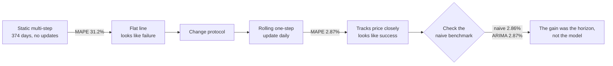
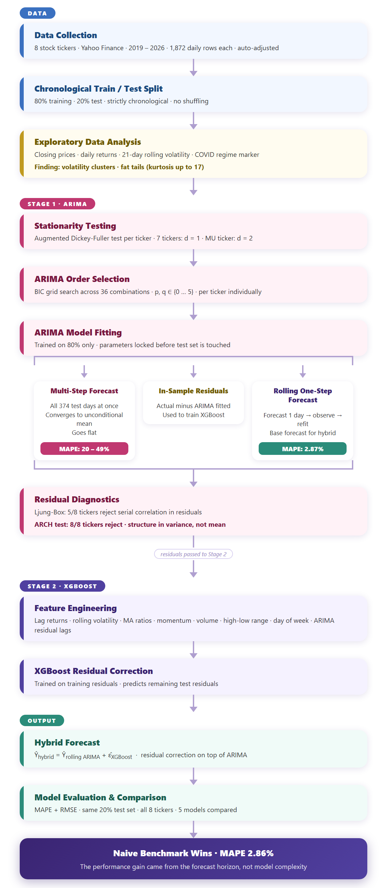
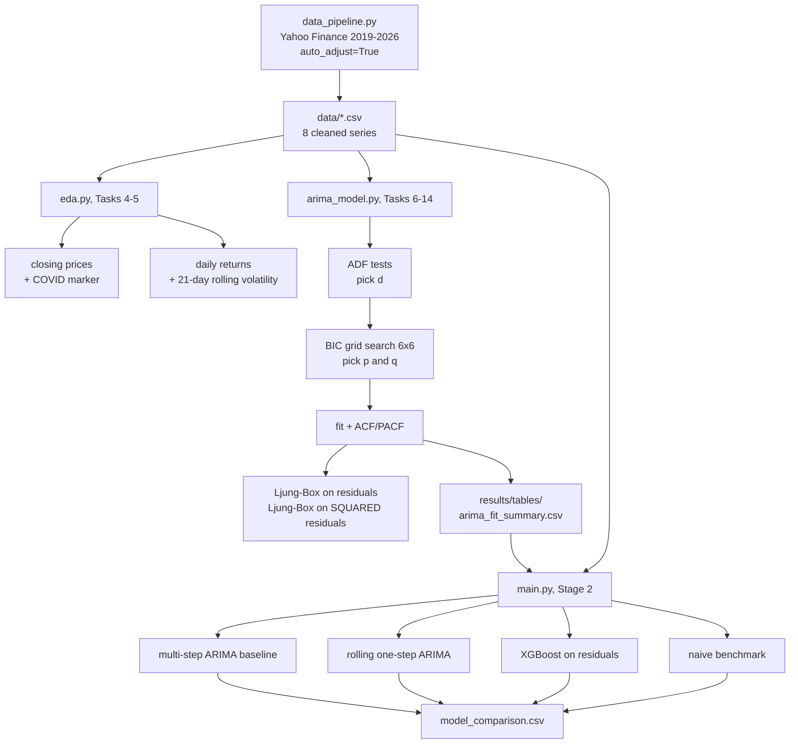
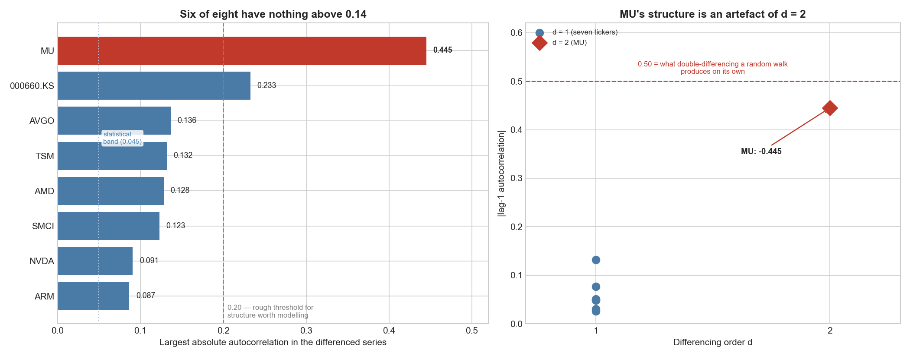

# A Hybrid ARIMA-XGBoost Model for Forecasting Volatile AI Semiconductor Stocks

**ACM 40960 Mathematical Modelling · University College Dublin**<br>
Soham Barve, Asawari Lad<br>
Supervisor: Dr. Sarp Akcay

---

## The question

Can a two-stage model, ARIMA for the linear part and XGBoost for whatever ARIMA
gets wrong, forecast daily closing prices of AI semiconductor stocks better than
a simple benchmark?

The design follows Wang & Guo (2020):

```
y  =  L  +  N

L = the linear trend            ->  ARIMA predicts this
N = the leftover ARIMA misses   ->  XGBoost predicts this
```

Eight tickers spanning the chip supply chain rather than one corner of it. NVDA
and AMD make the GPUs, SMCI builds the servers they sit in, ARM licenses the
architecture, MU and 000660.KS (SK Hynix) make the memory, AVGO supplies
data-centre networking silicon, and TSM fabricates nearly all of it. SK Hynix
trades in Korean won; the rest in dollars.

---

## What we found

We did not get the result we set out to get. Working out why became the project.

1. **ARIMA does not beat a random walk.** 2.87% mean test MAPE against the
   benchmark's 2.86%.
2. **The hybrid does not beat plain ARIMA.** 3.18% versus 2.87%, worse on all
   eight tickers. XGBoost contributes -0.31 percentage points.
3. **Six of eight tickers show no autocorrelation worth modelling.** The largest
   correlation anywhere in the differenced series is 0.136.
4. **Volatility clustering is present in all eight** at p < 0.0001. It is the one
   strong pattern in the data, and the one this architecture cannot use.

---

## How the methodology changed, and why

This section matters more than the results table, because the numbers only make
sense once you know how we arrived at them.

### Attempt 1, static multi-step

The first design fitted ARIMA on the training 80% and forecast the whole test
period in a single call:

```python
arima_test_pred = arima_model.forecast(steps=len(test_df))   # all 374 days at once
```

Every ticker produced a horizontal line. MAPE landed between 20.9% and 49.4%.

That is not ARIMA failing. Once a differenced model runs out of new observations
its forecast converges to the unconditional mean and stays there. Asking for 374
days with no updating is asking a question nothing can answer.

### Attempt 2, rolling one-step-ahead

So we changed the protocol. Forecast tomorrow, observe what actually happened,
feed it in, repeat:

```python
for actual_price in test_close:
    pred = current_fit.forecast(steps=1)
    current_fit = current_fit.append([actual_price], refit=False)
```

Setting `refit=False` keeps the coefficients frozen at their training values. The
model state advances but it never re-learns from test data.

Mean MAPE dropped from 31.2% to 2.87%. The flat line became a curve tracking the
price closely. It looked like a complete success.

### The check that changed our conclusion

Before writing it up we asked what the dumbest possible model scores under the
new protocol. "Tomorrow's price equals today's close." One line, no fitting.

**2.86%.**

ARIMA scored 2.87%. The hybrid scored 3.18%.

The improvement was real, but it measured the gap between forecasting 374 days
ahead and forecasting one day ahead. Prices move roughly 2% a day, so anything
anchored on yesterday's close scores 2% to 3% automatically. It was a property of
the question, not of the model.

We kept both protocols in the code and report both, because the contrast between
them is the clearest thing we have to show. What we removed was the claim that
the second one validated the hybrid.



---

## Pipeline



`arima_model.py` rebuilds this at the end of its run, if Graphviz is installed
(`pip install graphviz` plus the binaries from graphviz.org). If it isn't, the
step is skipped with a message and the committed PNG is used. The same structure
as a Mermaid chart, which GitHub renders without any install:



The only hard dependency is that `arima_model.py` must finish before `main.py`,
which reads the selected (p,d,q) from `arima_fit_summary.csv`. Everything else
can run in any order once the data is in place.

---

## Tasks 1 to 3, data

`data_pipeline.py` downloads daily bars for 2 Jan 2019 to 12 Jun 2026.

We use `auto_adjust=True`, which matters more than it sounds. Splits and
dividends get applied backwards through the series, so NVDA starts at $3.37
rather than $33.70 because the June 2024 ten-for-one split is already folded in.
Without it, that split would look like a 90% overnight crash and ARIMA would
model it as a real event.

Cleaning coerces price and volume columns to numeric, so anything non-numeric
becomes NaN and gets dropped rather than silently poisoning the model later.
Duplicate dates go, and everything sorts ascending.

**The cleaning found nothing to clean.** Zero rows removed, zero missing values,
across all eight tickers. We kept `cleaning_report.csv` as evidence the check ran.

| Ticker | Rows | Period |
|---|---|---|
| NVDA, AMD, SMCI, MU, AVGO, TSM | 1872 | 2019-01-02 to 2026-06-12 |
| 000660.KS | 1824 | 2019-01-02 to 2026-06-12 |
| ARM | 689 | 2023-09-14 to 2026-06-12 |

Two of those counts differ deliberately. **ARM** has 689 days because it listed
in September 2023, so no earlier data exists, leaving it about a third of the
history the others get. **SK Hynix** has 1824 because the Korea Exchange runs a
different holiday calendar. Each ticker is modelled on its own calendar.

---

## Tasks 4 and 5, exploratory analysis

### Closing prices

| Ticker | Min | Max | Latest | Total return |
|---|---|---|---|---|
| NVDA | 3.17 | 235.47 | 205.19 | 5983.2% |
| 000660.KS | 53,585 | 2,363,000 | 2,150,000 | 3720.3% |
| MU | 30.23 | 1079.57 | 981.46 | 2973.2% |
| AMD | 17.05 | 542.52 | 511.57 | 2616.8% |
| SMCI | 1.47 | 118.81 | 30.46 | 1917.2% |
| AVGO | 14.41 | 481.57 | 381.47 | 1722.9% |
| TSM | 29.24 | 445.65 | 423.93 | 1264.1% |
| ARM | 47.87 | 411.83 | 380.81 | 498.9% |

**Nothing is stationary.** Every series climbs by one to two orders of magnitude.
No constant mean, no constant variance. This is the first sign raw prices cannot
go into ARIMA directly.

**Growth is lumpy, not steady.** NVDA, AVGO, MU and TSM sit near-flat until 2023
and then take off. MU held around $50 for four years before reaching $1079. That
matters for the split, because the model learns one regime and is tested on
another.

**SMCI is the exception.** It peaks at $118.81 in early 2024 and ends at $30.46,
down 74% from its high, the only ticker whose latest price sits far below its
maximum. The 2024 accounting scandal that caused it left no trace in prior
prices, which is worth remembering when SMCI later proves the hardest ticker to
forecast.

### Why only the COVID crash is marked

We first marked four events: COVID, the ChatGPT launch, the ARM IPO and the NVDA
split. We cut it to one after measuring whether each did anything. The test was
realised volatility in the 60 days after, against each stock's own baseline.

| Event | Volatility vs baseline | Kept |
|---|---|---|
| COVID crash | **1.13x to 1.94x**, elevated on all 7 tickers then trading | Yes |
| ChatGPT launch | 0.68x to 1.25x, mostly *below* baseline | No |

The ChatGPT result surprised us. It moved prices enormously, with NVDA up 137%
over the following six months, but it did not make them jumpier. The sector
repriced upward calmly. It is a **level** event, not a **variance** event, and
since this project turned out to be about variance, COVID is the one that
illustrates the point.

The ARM IPO moved the other seven tickers between -3.4% and +3.7%, which is
nothing. And the NVDA split cannot appear in split-adjusted data at all, because
there is no discontinuity there by construction.

### Daily returns and volatility

| Ticker | Mean daily | Std dev | Max gain | Max drop | Skew | Kurtosis |
|---|---|---|---|---|---|---|
| ARM | 0.370% | 4.80% | 47.89% | -19.46% | 1.93 | 17.21 |
| SMCI | 0.275% | 4.80% | 35.94% | -33.32% | 0.58 | 11.71 |
| AMD | 0.237% | 3.49% | 23.82% | -17.31% | 0.63 | 4.73 |
| MU | 0.237% | 3.29% | 19.29% | -19.82% | 0.18 | 3.78 |
| NVDA | 0.271% | 3.20% | 24.37% | -18.45% | 0.31 | 4.67 |
| 000660.KS | 0.241% | 2.88% | 15.91% | -11.50% | 0.43 | 2.68 |
| AVGO | 0.191% | 2.68% | 24.43% | -19.91% | 0.31 | 10.38 |
| TSM | 0.167% | 2.36% | 12.65% | -14.03% | 0.20 | 3.24 |

**Differencing works.** Returns oscillate around roughly zero with no drift.

**Volatility clusters, obviously.** Calm stretches inside plus or minus 3%
alternate with turbulent ones where 10% days arrive repeatedly. NVDA's rolling
volatility swings between about 1.5% and 8.7%. This is the most important feature
in the dataset.

**Tails are fat.** Excess kurtosis is positive everywhere and extreme for ARM
(17.21), SMCI (11.71) and AVGO (10.38). ARM's 47.89% single day, the largest move
in our data, came in February 2024 after its first earnings as a public company.
It is a genuine move, not an error.

Note that pandas `.kurt()` reports excess kurtosis, so a normal distribution
scores 0 rather than 3.

---

## Tasks 6 to 14, the ARIMA stage

### Task 6, how much differencing

ADF tests. The null hypothesis is "non-stationary", so a *small* p-value is the
good outcome. This reads backwards from intuition and catches people out.

- Raw prices: **0 of 8** stationary
- First difference: **7 of 8** stationary, giving `d = 1`
- **MU fails at d=1** (p = 0.5515) and passes at d=2, giving `d = 2`

### Tasks 7 to 14, choosing p and q

Grid search over all 36 combinations of p and q from 0 to 5, selecting on BIC.

**We used BIC rather than AIC on purpose.** AIC's penalty for extra parameters is
too weak when a series is near white noise, which the ACF/PACF plots show several
of these are. AIC picks larger models that fit history slightly better and
forecast worse. BIC's penalty scales with sample size and pushes back harder.

| Ticker | Order | AIC | In-sample MAPE |
|---|---|---|---|
| NVDA | (0,1,4) | 8536.97 | 2.33% |
| AMD | (2,1,2) | 11482.37 | 2.51% |
| SMCI | (0,1,4) | 7851.97 | 2.99% |
| ARM | **(0,1,0)** | 4725.07 | 3.16% |
| MU | (2,2,4) | 13206.87 | 2.56% |
| AVGO | (4,1,0) | 11141.59 | 1.83% |
| TSM | (0,1,1) | 10238.64 | 1.72% |
| 000660.KS | (5,1,3) | 40884.03 | 2.62% |

ARM selects **ARIMA(0,1,0)**, which *is* the random walk. BIC concluded on its
own that no ARMA structure was worth estimating there.

### How much structure is actually in the data

The per-ticker ACF/PACF plots are the proper Box-Jenkins identification tool, but
sixteen panels do not make the point clearly. This collapses them into one figure:



| Ticker | Largest \|ACF\| in the differenced series | Lags above 0.20 |
|---|---|---|
| ARM | 0.087 | 0 |
| NVDA | 0.091 | 0 |
| SMCI | 0.123 | 0 |
| AMD | 0.128 | 0 |
| TSM | 0.132 | 0 |
| AVGO | 0.136 | 0 |
| 000660.KS | 0.233 | 4 |
| MU | **0.445** | 6 |

**Six of eight have nothing above 0.14.** There is essentially no linear
structure for ARIMA to work with, which is exactly what the forecasting results
go on to show.

One caution on reading these. With around 1870 observations the 95% confidence
band sits at only plus or minus 0.045, so a correlation of 0.05 registers as
"statistically significant" while being useless in practice. At this sample size,
magnitude matters more than significance.

### MU is over-differenced, and we should say so

MU's lag-1 autocorrelation is **-0.445**. That is the textbook signature of
over-differencing. Differencing a random walk twice mechanically produces a lag-1
correlation near -0.5, regardless of what the series actually does.

The pipeline behaved correctly here. MU's ADF test genuinely failed at `d=1`
(p = 0.5515), so the code escalated to `d=2` as designed. The ADF test is
struggling with MU's near-exponential run from $30 to $1,079 rather than
detecting real second-order structure.

So MU's apparent structure is something our differencing created, not something
MU has. It is the only ticker where this happens, and it explains why its ACF
plot looks so different from the other seven. A cleaner treatment would force
`d=1` for MU and note the ADF failure as a limitation.

### Residual diagnostics

Two Ljung-Box tests that sound like the same test and are not. The first asks
whether there is still a pattern in **which direction** the model errs. The
second squares the residuals first, discarding the sign, so it asks only about
**how big** the errors are.

| Test | Rejects for |
|---|---|
| Ljung-Box on residuals | 5 of 8 (AMD, SMCI, MU, TSM, 000660.KS) |
| Ljung-Box on squared residuals (ARCH) | **8 of 8**, all at p < 0.0001 |

**The mean equation is imperfect. The variance is emphatically not white noise.**
That distinction is the pivot of the whole project.

---

## Stage 2, XGBoost residual correction

`main.py` reads the BIC-selected order from `arima_fit_summary.csv`, refits ARIMA
on the training 80%, produces the rolling one-step forecast, then trains XGBoost
on the training residuals.

Features are lagged returns (1, 2, 3, 5, 10 days), 21-day rolling volatility,
moving averages and price-to-MA ratios (5, 10, 20), volume change and volume
ratio, high-low range, a momentum spread, day of week, plus lagged ARIMA
residuals and a 5-day rolling residual standard deviation. Everything is shifted
one day so a day-*t* feature vector contains only information that existed at
*t-1*.

```
hybrid = rolling ARIMA forecast + XGBoost residual correction
```

### The full comparison

All five approaches, same 80/20 split, MAPE %:

| Ticker | ARIMA multi-step | XGB alone | Hybrid | Rolling ARIMA | Naive |
|---|---|---|---|---|---|
| 000660.KS | 49.35 | 37.64 | 3.29 | 3.05 | **3.04** |
| MU | 39.35 | 29.78 | 3.54 | 3.31 | **3.30** |
| AVGO | 36.59 | 38.67 | 2.64 | **2.28** | 2.30 |
| AMD | 32.16 | 11.54 | 2.96 | 2.73 | **2.72** |
| TSM | 27.69 | 25.29 | 2.17 | **1.93** | 1.93 |
| NVDA | 20.92 | 15.84 | 2.25 | **2.04** | 2.06 |
| ARM | 22.18 | 11.18 | 4.04 | 3.44 | **3.44** |
| SMCI | 20.98 | 5.66 | 4.59 | 4.20 | **4.08** |
| **Mean** | **31.15** | **21.95** | **3.18** | **2.87** | **2.86** |

Three things follow.

**The hybrid beats plain rolling ARIMA on 0 of 8 tickers.** Mean XGBoost
contribution is **-0.31 percentage points**. Adding the correction makes the
forecast worse every time.

**Neither beats the naive benchmark.** Rolling ARIMA and naive are
indistinguishable at 2.87% versus 2.86%. ARM ties exactly, because BIC selected
the random walk there and the two models are literally identical.

**XGBoost alone is far worse than either** at 21.95%, and on AVGO (38.67%) it is
beaten even by the flat-line multi-step ARIMA. Left to itself the ML stage has no
usable concept of price level. All the performance comes from ARIMA.

### A note on `improvement_pct`

`model_comparison.csv` contains a column `improvement_pct`, computed as
`arima_multistep_mape` minus `hybrid_mape`, ranging from 16.3 to 46.1.

**That figure does not measure XGBoost's contribution.** It compares a 374-day
static forecast against a one-day-ahead rolling one, so it is dominated by the
horizon change, and it is a difference in percentage *points*. The column
`xgb_contribution_pp`, which is rolling minus hybrid, is the honest version.

### Why the correction adds nothing

The hybrid assumes ARIMA's residual **N** contains learnable structure. The
correlation between XGBoost's predicted residual and the realised residual on the
test set averages **0.000**, and it is negative on five of eight tickers. The
stage adds unstructured variance to an otherwise unbiased forecast.

This is a property of the target, not an implementation failure. ARIMA residuals
on daily equity prices are close to white noise in the *mean*. The structure that
remains is in the *variance*, where ARCH rejects on all eight, and a model
trained on the signed residual cannot capture it.

---

## Things that went wrong

Documented because catching them was most of the work.

**A degenerate model passed the convergence check.** During development one run
selected ARIMA(5,1,4) for NVDA with a BIC of 168 when every alternative scored
5500 or more. It reported `converged = True`, but its residuals had a standard
deviation of 1887 on a series ranging from $3 to $148. The optimiser had reached
a degenerate region and returned a meaningless likelihood. Test MAPE was 6078%.

`find_best_order` now also rejects any fit whose residual standard deviation
exceeds the standard deviation of the series itself, since a model whose errors
are wider than the data has not fitted anything.

**The two stages disagreed about the split.** `arima_model.py` used
`int(len(df) * 0.80)` while `main.py` used `len(df) - int(len(df) * 0.2)`. One row
apart, so the halves described slightly different test periods.

**Every chart said "Price (USD)"**, including SK Hynix, which trades in won.
Fixed with a per-ticker currency lookup.

**A validation split made things worse.** We tried 60/20/20 so the second stage
could train on genuine out-of-sample residuals rather than in-sample ones. It
lost on every measure. ARIMA lost a third of its training data, XGBoost lost
three quarters of its rows, and the middle period turned out to be a different
volatility regime from the last. We reverted.

---

## Limitations

- **MU is over-differenced.** See above. Its ARIMA(2,2,4) is fitting an artefact.
- **Survivorship bias.** We chose eight firms prominent *today*. For a negative
  result this cuts the safe way, since a survivor-biased sample should be
  *easier* to forecast, but a clean study would use point-in-time index
  membership.
- **One test window**, and it happens to be a strong sector uptrend.
- **MAPE is asymmetric.** We use it because SK Hynix's won prices make
  scale-dependent metrics impossible to pool. Per-ticker RMSE is in the tables.
- **No costs, no strategy.** This is a forecasting study, not a backtest.
- **ARM has 137 test observations** against 374 for the others.

---

## Questions we expect

**What is your benchmark?**
Random walk, meaning tomorrow equals today's close, at 2.86% MAPE. ARIMA gets
2.87% and the hybrid 3.18%, so the benchmark wins. We rebuilt the evaluation once
we realised our original comparison put a one-day-ahead hybrid against a
374-day-ahead ARIMA.

**Is 2% MAPE not good?**
It is an artefact of forecasting price *levels*. Daily moves are small relative
to price, so anything anchored to yesterday scores 2% to 3%.

**So there is no signal at all?**
Not in the mean. Six of eight tickers have no autocorrelation above 0.14. In the
variance, definitely: ARCH rejects on all eight at p < 0.0001. Direction is not
predictable; magnitude is. Our architecture targeted the first.

**Why did you switch from multi-step to rolling?**
A 374-day static forecast converges to the unconditional mean and returns a flat
line, which is the model behaving correctly on an unanswerable question. Rolling
one-step is the realistic deployment protocol. What we then found is that the
improvement came from the horizon, not the model.

**Did you tune XGBoost properly?**
Tuning was not the constraint. Predicted and realised residuals correlate at
0.000, and more trees cannot create signal that is not in the target.

**How do you control for look-ahead bias?**
Features are lagged one day, the split is chronological, and the rolling forecast
appends each actual price only after that day's prediction is made.

**Why not LSTM or a Transformer?**
The constraint is signal-to-noise in the target, not model capacity. With no
autocorrelation above 0.14 to exploit, more capacity finds more noise.

**Is this not just the efficient market hypothesis?**
It is consistent with weak-form efficiency. What we would argue is added: we test
it in a sector widely described as speculative over 2023 to 2026, using a method
specifically proposed to beat it, and we localise *where* predictability is
absent (the mean) versus where it exists (the variance).

**Why did you not reproduce Wang & Guo?**
Most likely the wavelet step. They apply a discrete wavelet transform before
ARIMA, splitting the series so each model receives the component it suits,
whereas we pass raw prices to ARIMA and raw residuals to XGBoost. Different asset
class and period too.

---

## Running it

```bash
pip install pandas numpy statsmodels xgboost matplotlib scikit-learn yfinance
```

Five files, run in this order. `arima_model.py` must come before both
`acf_summary_plot.py` and `main.py`, since they read what it writes.

```bash
python data_pipeline.py     # ~1 min, needs internet. optional, CSVs are committed
python eda.py               # ~20 sec
python arima_model.py       # ~6 min
python acf_summary_plot.py  # ~5 sec, the summary figure above
python main.py              # ~1.5 min
```

About 8 minutes end to end.

`END_DATE` is hardcoded to 2026-06-14 so the dataset stays reproducible.

On reproducibility: XGBoost results vary in the third decimal place across
machines even with `random_state=42`, because thread scheduling changes
floating-point summation order. Expect the hybrid mean to land between 3.15% and
3.20%.

---

## References

1. Adebiyi, A.A., Adewumi, A.O., Ayo, C.K. (2014). *Stock Price Prediction Using
   the ARIMA Model.* 16th UKSim-AMSS International Conference on Computer
   Modelling and Simulation, IEEE.
2. Wang, Y., Guo, Y. (2020). *Forecasting Method of Stock Market Volatility Based
   on Mixed Model of ARIMA and XGBoost.* China Communications, IEEE.
3. Somkunwar, R.K., Pimpalkar, A., Srivastava, V. (2024). *A Novel Approach for
   Accurate Stock Market Forecasting by Integrating ARIMA and XGBoost.* IEEE
   SCEECS.
4. Zhang, F., Chen, L., Yu, J. (2022). *A Two-Stage ARIMA Model via Machine
   Learning and its Application in Stock Price Prediction.* BCP Business &
   Management, 26, 400 to 408.
